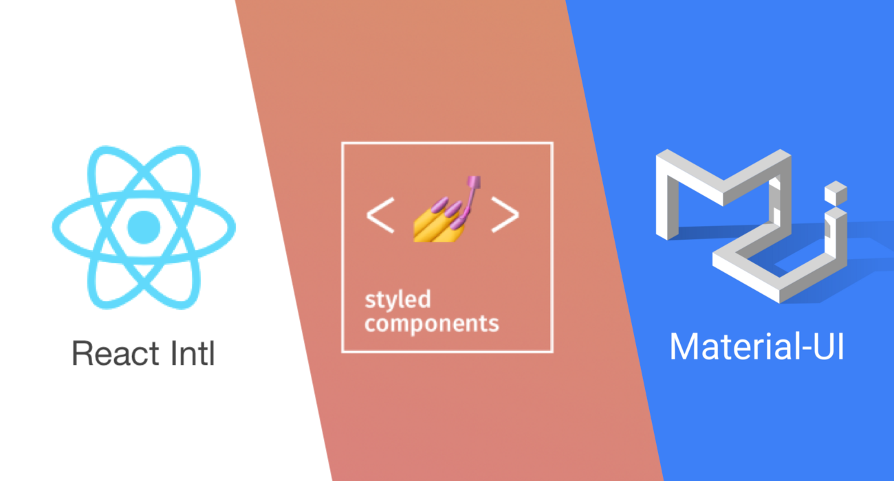

I've been working on React for months now, since the I've used tons of react libraries. To my belief, I've seen quite new tools slowly replacing old libraires.

# For Components

Component libraries help us develop better when we don't have strong styling directives. Most of the time, they provide us with additional features and remove a lot of biolerplate code.

## 1. Ant Design

This react component provides some enterprise-level products. You don't need to worry about "not being able to do the component" You'll be able to get it done.

Another thing to note is that Ant Design is a design system. It is meant to be opinionated. Overall, it is a fun to use compared to Material UI. There’s still some things I don’t like about Ant Design. If you want to customize Ant Design theme you need to change variables during your build. To me it feels like a lot of work for little things like changing colors.

## 2. Material UI

If I were not to use Ant Design, Material-UI would be the second choice. It's components are for faster and easier web development. You can even build your own design system, or start with Material Design.

# For Icons

## 1. React Feather

React-feather is a collection of simply beautiful open source icons for React.js. Each icon is designed on a 24x24 grid with an emphasis on simplicity, consistency, and readability.

React-feather is also a collection of SVG files so you can use them in any way (image, background image, object, inline, etc.) depending upon the need. Overall, I prefer it over others.

## 2. Material UI Icons

It is a complete React UI framework and it provides one of the best icons support in three following ways:

- Standardized Material Design Icons exported as React Components (SVG).
- With the SVG Icon component, a React wrapper for custom SVG icons.
- With the Icon components, a React wrapper for custom font icons.

# For state management

## 1. Redux

You already knew this was coming, right? So, yes - Redux is de-facto "the default" of its kind. But it starts to "show its age" and if not that, then to irritate some devs. Don't get me wrong - it's a great library, but its size, steep learning curve, and verbose action-reducer approach to state management can make some people want to switch.

## 2. Hookstate

It's the underdog of the state-management libraries. It's small, minimal, clean, extendable, and it has a lovely hook-based API. Not only can it be used for global state, but can also enhance local `useState()` with additional features, handle nested state without performance loss, and deal with async data with ease!

## Conclusion

Those were all my favourites, what's your? Let me know on Twitter. Thank you for taking the time to read my blog.
