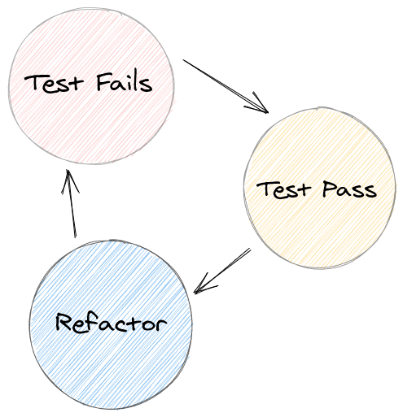

If you haven't heard of TDD, it means Test Driven Development. What do I mean by that? Let's talk about it today.

## Let's make sense

Test-driven development (aka TDD) is a three-step process. It's often referred to as the "red, green, refactor cycle"

Let me explain the process:

- **Red**: It involves writing a function to test a feature which you're going to add in the project/app. It'll fail onbviously and you get a red error message.

- **Green**: Next up, we add the functionality/feature to the app in-order to pass the test and you get a green success message.

- **Refactor**: Now we need to look at the code and refactor it to ensure it's well-written, and easy to read/understand.

> You repeat the same process over and over again until you have added all the required functionality.

**Bonus:** Using this cycle saves you if you break something while implementing other functionalities.

## When does it make sense?

- **Utility Functions**: If I've a function which has a certain set of inputs or ouputs, and of a certain complexity. I prefer setting up a test for it.

- **Well defined UI**: If I'm trying to achieve certain UI goals in my app, I prefer setting up a test for it.

- **Fixing a bug**: This also helps me in replicating the issue so that I can understand the problem better.

### But when it doesn't?

- When you're learning about new features and implementation (aka exploratory coding), I wouldn't follow this cycle.

- It is waste of your precious time if you're testing the implementation details.

## My conclusion

Go follow TDD if you believe you'll be working on the project in the long run. Because I believe **Time** is an important resource, and you should utilize it to the fullest. Goo luck!
